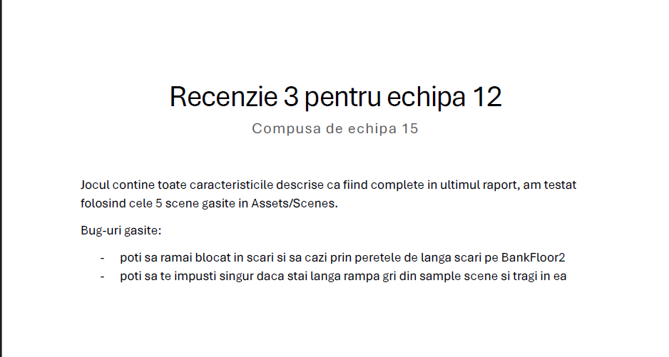

# Heist Master
Software Engineering - Product Șutdaun


## Analysis
+ ### Product Vision
  To immerse players in the ultimate heist experience, combining strategic planning and high-stakes action, where every difficulty is a thrilling and dynamic adventure.
+ ### Requirements, User Personas, Features
  These are included in the GDD(Game Design Document) file from the [Documentation](./Documentation) folder.

## Source Code
The code for project can be found [here](https://github.com/TaviF24/Game).

## [Demo video](https://www.youtube.com/watch?v=eAG_1nOb3Es)

## Planning
+ ### Backlog
  For our backlog, we used Github Issues and Jira. To access it on Jira, click [here](https://raducordunianu02.atlassian.net/jira/software/projects/SCRUM/boards/1) and you have to log in and have permission to our project.

## Design | Architectural Description
+ ### Diagrams
  - UML Diagram
      ```mermaid
          classDiagram
              class Interactable {
                  <<abstract>>
                  - useEvents: bool
                  - promptMessage: string
                  *+ Interact()*: void
                  + BaseInteract(): void
              }
      
              class KeyPad {
                  - objectToInteractWith: GameObject
                  + Interact(): void
              }
      
              class EventOnlyInteractable { }
      
              class InteractableEditor {
                  - sampleObject: EventOnlyInteractable
                  + OnInspectorGUI(): void
              }
      
              class InteractionEvent { 
                  - OnInteract: UnityEvent 
              }
              
              Interactable <|-- EventOnlyInteractable : extends
              EventOnlyInteractable --* InteractableEditor
              Interactable <|-- KeyPad : extends
      
              class Map {
                  - npcSpawner : NPCSpawner
              }
      
              class NPCSpawner {
                  - listOfNPCs : List~NPC~
                  - npcCounter : int
                  + Spawn() : void
              }
      
              class NPC {
                  - stateMacine : StateMachine
                  - agent : NavMeshAgent
                  - currentState : string
                  - path : PathAI
                  + Agent : (NavMeshAgent: Get;)
              }
      
              class PathAI {
                  - waypoints : List~Transform~
                  - alwaysDrawPath : bool
                  - drawAsLoop : bool
                  - drawNumbers : bool
                  - debugColour : Color
                  + OnDrawGizmos() : void
                  + DrawPath() : void
                  + OnDrawGizmosSelected() : void
              }
      
              class StateMachine {
                  - activeState : BaseState
                  + Initialize() : void
                  + Update() : void
                  + ChangeState(BaseState newState) : void
              }
      
              class BaseState {
                  <<abstract>>
                  - enemy : enemy
                  - stateMachine : StateMachine
                  *+ Enter()* : void
                  *+ Perform()* : void
                  *+ Exit()* : void
              }
      
              class PatrolState {
                  - waypointIndex : int
                  - waitTimer : float
                  + Enter() : void
                  + Perform() : void
                  + Exit() : void
                  + PartolCycle() : void
              }
      
              class SearchState {
                  - searchTimer : float
                  - movingTimer : float
                  + Enter() : void
                  + Perform() : void
                  + Exit() : void
              }
      
              class AttackState {
                  - movingTimer : float
                  - losingPlayerTimer : float
                  - shotTimer : float
                  + Enter() : void
                  + Perform() : void
                  + Exit() : void
                  + Shoot() : void
                  + Start() : void
                  + Update() : void
              }
      
              class NPCNonEnemy {
                  - followPattern : FollowPattern
              }
      
              class FollowPattern {
                  + Start() : void
                  + Update() : void
              }
      
              class NPCEnemy {
                  - enemy : Enemy
              }
      
              class Enemy {
                  - agent : NavMeshAgent
                  - debugSphere : GameObject
                  - player : GameObject
                  - Player : (GameObject: Get;)
                  - lastKnownPos : Vector3
                  - LaskKnownPos : (Vector3: Get; Set;)
                  - distanceForSight : float
                  - fieldOfVieew : float
                  - eyeHeight : float
                  - gunBarrel : Transform
                  - fireRate: float
                  + Start() : void
                  + SeePlayer() : bool
                  + Update() : void
              }
      
              Map --* NPCSpawner
              NPCSpawner --* NPC
              StateMachine --* BaseState
              BaseState <|-- AttackState : extends
              BaseState <|-- SearchState : extends
              BaseState <|-- PatrolState : extends
              NPC <|-- NPCEnemy : extends
              NPCEnemy --* Enemy
              NPC <|-- NPCNonEnemy : extends
              NPCNonEnemy --* FollowPattern
              NPC --* StateMachine
              NPC --* PathAI
      
      
              class GameManager {
                  - instance : GameManager
                  - isStealth : bool
                  - player : Player
                  - guiManager : GUIManager
                  - sceneManager : SceneManager
                  - musicManager : MusicManager
                  - audioManager : AudioManager
                  - saveProgressManager : SaveProgressManager
                  + Awake() : void
              }
          
              class AudioManager {
                  - instance : AudioManager
                  - audioSourcePrefab : GameObject
                  - timeToSwitch : float
                  - audioSourceCount : int
                  - audioSources : List~AudioSource~
                  - volume : float
                  + Awake() : void
                  + Start() : void
                  + Init() : void
                  + Play(AudioClip audioClip) : void
                  + GetFreeAudioSource() : AudioSource
              }
          
              class MusicManager {
                  - instance : MusicManager
                  - audioSource : AudioSource
                  - timeToSwitch : float
                  - playOnStart : AudioClip
                  - volume : float
                  - switchTo : AudioClip
                  + Awake() : void
                  + Start() : void
                  + Play(AudioClip musicToPlay, bool interrupt) : void
                  + SmoothSwitchMusic() : IEnumerator
              }
          
              class GameData {
                  - health : float
                  - playerPosition : float[]
                  - isStealth : bool
                  - currentScene : string
                  + GameData(GameData data) : Constructor
              }
          
              class SaveProgressManager {
                  - savedGames : List~GameData~
                  + SaveGame(GameData dataToSave) : void
                  + LoadGame() : GameData
              }
      
              class ScreenTint {
                  - untitledColor : Color
                  - tintedColor : Color
                  - image : Image
                  - speed : float
                  + Awake() : void
                  + Tint() : void
                  + Untint() : void
                  + TintScreen() : IEnumerator
                  + UntintScreen() : IEnumerator
              }
              
              class SceneManager {
                  - instance : SceneManager
                  - screenTint : ScreenTint
                  - cameraConfiner : CameraConfiner
                  - currentScene : string
                  - unload : AsyncOperation
                  - load : AsyncOperation
                  + Awake() : void
                  + Start() : void
                  + InitSwitchScene(string sceneTo, Vector3 targetPosition) : void
                  + Transition(string sceneTo, Vector3 targetPosition) : IEnumerator
                  + SwitchScene(string sceneTo, Vector3 targetPosition) : void
              }
          
              class GUIManager {
                  - instance : GUIManager
                  - isVisible : bool
                  + SaveGame() : void
                  + LoadGame() : void
                  + ChangeSensitivity(float input) : void
                  + ChangeAudioVolume(float input) : void
                  + ChangeMusicVolume(float input) : void
              }
      
              GUIManager --* GameManager
              AudioManager --* GameManager
              MusicManager --* GameManager
              ScreenTint --* SceneManager
              SceneManager --* GameManager
              GameData --* SaveProgressManager
              SaveProgressManager --* GameManager
          
              class Player {
                  - CharacterController : Unity Component
                  - inputManager : InputManager
                  - playerMotor : PlayerMotor
                  - playerLook : PlayerLook
                  - playerHealth : PlayerHealth
                  - audioController : AudioController
              }
          
              class PlayerLook {
                  - cam: Camera
                  - xRotation: float
                  - xSensitivity : float
                  - ySensitivity : float
                  + ProcessLook(Vector2 input) : void
              }
          
              class InputManager {
                  - playerInput : PlayerInput
                  - onFoot : PlayerInput.OnFootActions
                  - motor : PlayerMotor
                  - look : PlayerLook
                  + Awake() : void
                  + FixedUpdate() : void
                  + LateUpdate() : void
                  + OnEnable() : void
                  + OnDisable() : void
              }
          
              class PlayerMotor {
                  - controller : CharacterController
                  - playerVelocity : Vector3
                  - speed : float
                  - isGrounded : bool
                  - jumpHeight : float
                  - gravity : float
                  - isCrouching : bool
                  - lerpCrouch : bool
                  - crouchTimer : float
                  - isSprinting : bool
                  + Start() : void
                  + Update() : void
                  + ProcessMove(Vector2 input) : void
                  + Jump() : void
                  + Crouch() : void
                  + Sprint() : void
              }
          
              class PlayerHealth {
                  - health : float
                  - lerpTimer : float
                  - maxHealth : float
                  - chipSpeed : float
                  - frontHealthBar : Image
                  - backHealthBar : Image
                  - overlay : Image
                  - duration : float
                  - fadeSpeed : float
                  - durationTimer : float
                  + Start() : void
                  + Update() : void
                  + UpdateHealthUI() : void
                  + TakeDamage(float damage) : void
                  + RestoreHealth(float healAmount) : void
              }
      
              class PlayerUI {
                  - promptText : TextMeshProUGUI
                  + Start() : void
                  + UpdateText(string promptMessage) : void
              }
      
              class PlayerInteract {
                  - cam : Camera
                  - interactDistance : float
                  - mask : LayerMask
                  - playerUI : PlayerUI
                  - inputManager : InputManager
                  - soundsMade : List~AudioClip~
                  - audioController : AudioController
                  + Start() : void
                  + Update() : void
              }
          
              class AudioController {
                  + Play(AudioClip sound) : void
              }
      
              GameManager *-- Player
              Player *-- PlayerLook
              Player *-- InputManager
              Player *-- PlayerMotor
              Player *-- AudioController
              Player *-- PlayerHealth
              Player *-- PlayerInteract
              Player *-- PlayerUI
      ```
  - C4 Diagrams
    * System Context <br>
        
    * Container <br>
        
    * Component <br>
        
    * Overview <br>
        
+ ### Synthesis

## QA

During the development process, our team dedicated significant attention to the QA stages, using various types of testing. Since it was a game project, the testing was exclusively manual but conducted with a high degree of rigor.

---

+ ### Functional Testing
Throughout the development of the game’s functionalities, the entire team was involved in the testing process. Once a developer finished implementing a specific functionality, they tested it individually. When confident that their code was fully functional, the rest of the team began testing the functionality to ensure a high standard of quality.  
Additionally, after implementing any new functionality, we conducted **Regression Testing** to ensure that adding new features did not affect existing components or compromise the project's integrity.

---

+ ### User Testing
During development, we collaborated with other teams to test our products. In nearly every sprint, we exchanged intermediate products with other teams to test each other’s functionalities.  
The primary goal of this was to identify weaknesses in the user interface (UI) and game experience from the perspective of a first-time player and to receive objective and "merciless" feedback. Over the course of 7 sprints, we received **4 reviews** of the game.<br>

+ Example of review <br>
    
---

+ ### Performance Testing
From a performance standpoint, we took all necessary implementation measures early on to avoid overloading the user’s device. However, to ensure this at all times, we tested the product on multiple devices with varying specifications. This helped us ensure that the client’s device performance would not negatively impact their experience with our product.

---

+ ### Security Testing
Security was one of our top priorities, as we aimed to provide users with a highly reliable product. The measures we implemented adhered to the highest standards in the field and are detailed in a dedicated section of the documentation.

## Security Analysis
+ ### Protecting Player Data
  + **Risk:** Players might modify save files to alter game data, such as health, ammo.
  + **Solution**

    We want our game save file to be protected against unauthorized access by encrypting it.

    The file is encrypted with an AES 128-bit encryption key and a 16-byte initialization vector *(to ensure the encrypted file content is unique, even if there are no changes)*, which is then encoded into a Base64 string for easy file storage.

    **[Cryptography.cs](https://github.com/TaviF24/Game/blob/6ec60040569b046c3c74f2e6a2de4c4485ea8796/Game/Assets/Scripts/DataPersistence/Cryptography.cs)**
    ```c#
    public byte[] Encode(byte[] bytes, byte[] key, byte[] vector)
    {
          Aes aes = Aes.Create(); // instance of AES Encryption Object
          ICryptoTransform encryptor = aes.CreateEncryptor(key, vector); // will perform the encryption using the key and IV
          MemoryStream memoryStream = new MemoryStream(); // temporary storage for encrypted data
          CryptoStream cryptoStream = new CryptoStream(memoryStream, encryptor, CryptoStreamMode.Write); // link memoryStream to encryptor
          cryptoStream.Write(bytes, 0, bytes.Length); // write data as plaintext, where it then gets encrypted
          cryptoStream.Close();
          return memoryStream.ToArray();
    }
    ```
  
    **[FileDataHandler.cs](https://github.com/TaviF24/Game/blob/6ec60040569b046c3c74f2e6a2de4c4485ea8796/Game/Assets/Scripts/DataPersistence/FileDataHandler.cs)** extends Cryptography
    ```c#
    private byte[] key = new byte[16] { x, x, x, x, x, x, x, x, x, x, x, x, x, x, x, x };
    byte[] iv = new byte[16] { y, y, y, y, y, y, y, y, y, y, y, y, y, y, y, y };
    ```
  
    By protecting our **game.data** file, we can prevent players from gaining an unfair advantage since reading/modifying variables is impossible without the key and IV.
  
    <br>
  
    ***Save file location:***
    `C:\Users\%USERNAME%\AppData\LocalLow\DefaultCompany\Game\game.data`
    
    **game.data** *as a json, before encryption*
    ```json
    {
      "playerPosition": {
          "x": -19.420000076293947,
          "y": -0.2408899962902069,
          "z": 16.200000762939454
      },
      "playerHealth": 78.0,
      "lastScene": "BankFloor1",
      "detected": true,
      "anticipation": false,
      "assault": true,
      "timeInAnticipation": 30.008705139160158
    }
    ```
  
    **game.data** *as a Base64 string, after encryption + encoding*
    ```
    SaS+knakQ3NejCinK7OrPUFoUGfJr07wEV4ZB6YdUoAf6pVet+rqJZa92QMbDmdKxbHmY4TkwAWalkT4p8p7hduD+LLovrVPwYmW1tvUOIKQsOCQ4cn6h1hdFpD2UFapIBpfYvoe4xwdLRIvSnki+lqtCSHg5hcJRjncdUv+fdwKtcOOAunbf2Gq6HrO5AQ3OflGb1UEaqTNGY/5FlcOTav6gBbs+d7gSrBcZwhI73HUgyP9TEI2QrABfTekactJukmlYQDMcqdsHufNu4ipSV4Fm6VIoudeCBQ0sjYyQSsoMjTR3hJ8hy6cXP9VgZpmlWtTcokhd5ijNNdFRRbgZUHcsnQzY/DUeA6EmmoAcAX0o82DRuT/A0AYM0TD5PBNS0s+Tf2ETZGiadaM7cWDZA==
    ```

+ ## Other possible threats
+ ### Memory Manipulation
  + **Risk:** Players could use external tools *(Cheat Engine)* to modify the game variables stored in memory (infinite money, health; alter detection status).
  + **Possible solutions:** Anti-cheat software to detect unauthorized access, memory validation.

+ ### AI Exploitation
  + **Risk:** Players could exploit weaknesses in the bodyguard AI code and game mechanics to bypass detection.
  + **Possible solutions:** Improving AI logic by adding random patrol paths to make the AI less predictable.
## CI/CD
---
+ ## Describing the Used Environments
    ### The project benefited of three CI/CD pipelines:
- #### Developer Environment (Dev):
    - This is where the team actively worked on and tested new features.
    - In CI/CD, this environment was primarily used for running **unit tests** and **build tests**, ensuring that code changes were correct and that no issues were introduced (e.g., resolving bugs that a colleague had worked on).
    - Frequent deployments happened here to ensure continuous testing of the latest code changes.
- #### Staging Environment:
    - A staging environment closely mirrors the production environment and is used for final testing before public release.
    - It was configured to be as close to production as possible, and **User Acceptance Testing (UAT)** was performed here to validate the game’s readiness for release.
    - This environment served as the stage where users often flagged bugs or performance issues, providing valuable feedback for final improvements.
- #### Production Environment (Prod):
 - The production environment is where the end-users interacted with the game.
    - CI/CD ensured that only thoroughly tested and stable versions of the project made it to production, reducing the risk of deploying broken or incomplete features.
    - Critical updates or bug fixes were the only changes pushed to this environment to ensure the game remained stable for users.

+ ## Differences Between Environments (Dev, Staging, Prod)
    ### Each environment has unique characteristics, depending on its role in the development and deployment pipeline:

- #### Development:
    - The development environment was frequently updated with every new commit.
    - It was primarily used to test new features, fixes, and improvements.
    - This environment was often unstable due to the constant flow of changes, but it allowed for real-time debugging and collaboration among team members.
- #### Staging:
    - The staging environment mirrored the production environment as closely as possible.
    - It served as the final step before deploying to production, used for bug fixes, and **User Acceptance Testing (UAT)**.
    - While generally more stable than development, it could still have bugs due to the introduction of new features or unfinished work.
- #### Production:
    - The production environment represented the final, stable version of the game that users experienced.
    - No new features or changes were deployed unless they were bug fixes or critical improvements that were overlooked in development or staging.
    - CI/CD ensured that the deployment to production was smooth, and that the latest release was free of bugs.
    
+ ## Specific Configuration in CI/CD Pipeline
    ### The CI/CD pipeline was configured to automate various stages of testing and deployment:

- #### Unit tests:
    - Automated tests were run every time new code was pushed to the development branch.
    
    
    
    - Unity's Test Framework (or another testing tool) was used to ensure individual parts of the game code were functioning correctly.
   
     

- #### Build tests:
    - On every commit, the project was built to ensure that no changes had broken the build.
    - Tools like `game-ci/unity-builder` were used to automate the build process within the CI pipeline, ensuring continuous integration and reducing manual intervention.
- #### User Tests:
    - Every two weeks, a group of students manually tested the game, providing feedback on bugs, gameplay issues, and feature suggestions.
    - These tests focused on the **user experience**, ensuring the game was engaging, bug-free, and enjoyable for players.
- #### CI/CD configuration:
    - The pipeline was configured using **GitHub Actions**, with separate workflows defined for different stages such as testing and building.
    
    
    
    - **Caching** was used to speed up builds and tests by reusing previously built assets and dependencies (using `actions/cache`).
    - The pipeline environment was set up with necessary **secrets** and **variables** (Unity license, credentials), ensuring a secure and automated process.
    
    
